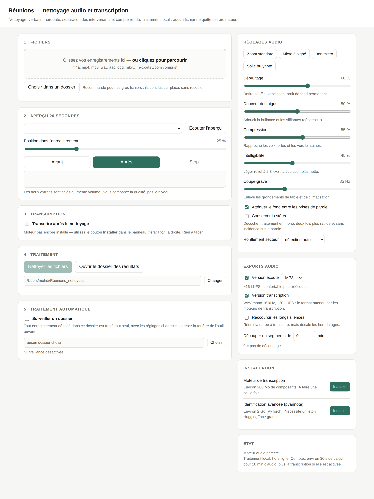
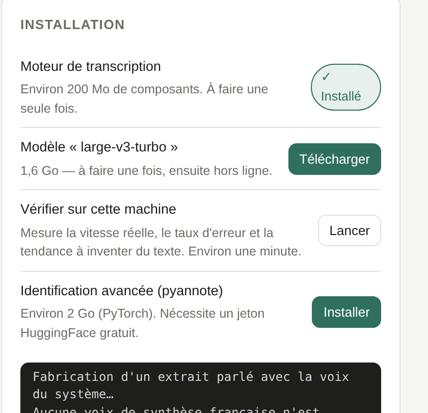

# Réunions — nettoyage audio et transcription, en local

Transforme un enregistrement de réunion (export Zoom, dictaphone, visio) en un audio propre,
un verbatim horodaté avec les intervenants séparés, et un compte rendu Word — **sans qu'aucun
fichier ne quitte la machine**.



Pensé pour ceux qui transcrivent des réunions confidentielles : rien n'est envoyé à un service
en ligne, il n'y a pas de coût à la minute, et aucune commande à taper.

---

## Démarrer

1. Installer [Python 3.9 ou plus récent](https://www.python.org/downloads/) — sous Windows,
   cocher « Add python.exe to PATH ».
2. Télécharger ce dépôt (bouton vert **Code → Download ZIP**) et le décompresser.
3. Double-cliquer sur `Demarrer_Mac_Linux.command` ou `Demarrer_Windows.bat`.

Le navigateur s'ouvre sur `http://127.0.0.1:7862`. Tout le reste — installer la transcription,
télécharger les modèles, choisir les dossiers — se fait par des boutons dans la page.

`ffmpeg` est installé automatiquement par le paquet `imageio-ffmpeg` ; s'il est déjà présent
sur le système, c'est lui qui sert.

---

## Ce que ça fait

**Nettoyage audio** — analyse du fichier, puis pour chaque bloc de 30 secondes : coupe-grave,
réjecteurs sur le ronflement secteur détecté, débruitage spectral, égalisation adoucissante,
expandeur, désesseur, compresseur, limiteur, calage de sonie ITU-R BS.1770. Le traitement est
en flux : mémoire constante quelle que soit la durée.

**Deux exports audio** — une version écoute (−16 LUFS) et une version transcription
(WAV mono 16 kHz, −20 LUFS), le format qu'attendent les moteurs de reconnaissance.

**Transcription locale** — [faster-whisper](https://github.com/SYSTRAN/faster-whisper), du
modèle `tiny` au `large-v3`. Un champ de vocabulaire permet de souffler au moteur les noms
propres et les sigles maison.

**Identification des intervenants** — méthode intégrée (MFCC + regroupement hiérarchique,
numpy/scipy seulement), ou [pyannote.audio](https://github.com/pyannote/pyannote-audio) s'il
est installé.

**Livrables** — compte rendu Word (temps de parole, relevé automatique, verbatim), verbatim
texte, sous-titres SRT, et un JSON structuré pour enchaîner d'autres traitements.

**Traitement automatique** — surveiller un dossier : tout enregistrement déposé est traité
tout seul.

---

## Mesures

Sur un échantillon de test reproductible (souffle large bande, ronflement 50 Hz, clics clavier,
un intervenant 12 dB plus faible), généré par `tests/make_sample.py` :

| Mesure | Avant | Après |
|---|---|---|
| Bruit de fond | −36,4 dB | −63,4 dB |
| Contraste parole / bruit | 16,2 dB | 43,1 dB |
| Ronflement 50 Hz | référence | −45 dB |
| Crête finale | — | −1,1 dBFS, aucun dépassement |
| Débuts de mots (44 prises de parole) | — | −1,4 dB, contre −5,4 dB avant la version 1.2.0 |

Une réunion d'une heure est nettoyée en environ 2 min 30, sous 400 Mo de mémoire.

Sur des dialogues de référence à 1, 2 et 3 voix distinctes (`tests/make_dialogue.py`),
l'identification des intervenants retrouve le bon nombre de locuteurs et attribue correctement
100 % du temps de parole. Ce sont des voix synthétiques bien séparées : sur des voix réelles
proches, captées par le même micro, attendez-vous à moins bien.

```bash
python tests/test_dsp.py            # 14 tests du traitement du signal
python tests/test_transcription.py  # 39 tests : transcription, intervenants, livrables
python tests/make_sample.py && python tests/evaluate.py
```

---

## État du projet

Mesuré et testé : la chaîne audio, l'identification des intervenants, le relevé automatique,
la génération des livrables, l'interface et le dossier surveillé.

La transcription Whisper est écrite contre l'interface publique de `faster-whisper` mais n'a
pas pu être éprouvée de bout en bout dans l'environnement de développement, faute d'accès au
téléchargement des modèles. **L'outil sait donc se vérifier lui-même** : le bouton
*Vérifier sur cette machine* du panneau Installation fabrique un extrait parlé avec la voix
de synthèse du système, le fait transcrire, et rend le taux d'erreur, la vitesse réelle et le
nombre de mots inventés sur du silence. Une minute, et vous savez où vous en êtes.



Les retours sur de vrais enregistrements restent la priorité — voir [TESTEURS.md](TESTEURS.md).

---

## Documentation

- [MANUEL.md](MANUEL.md) — mode d'emploi détaillé, réglages, résolution de problèmes
- [TESTEURS.md](TESTEURS.md) — ce qu'il faut essayer et comment faire un retour utile
- [DEPENDANCES.md](DEPENDANCES.md) — inventaire des licences des composants
- [CONTRIBUTING.md](CONTRIBUTING.md) — comment proposer une modification

## Licence

[GPL-3.0](LICENSE) — libre d'utilisation, de modification et de redistribution ; toute version
redistribuée doit rester sous la même licence et fournir son code source.
